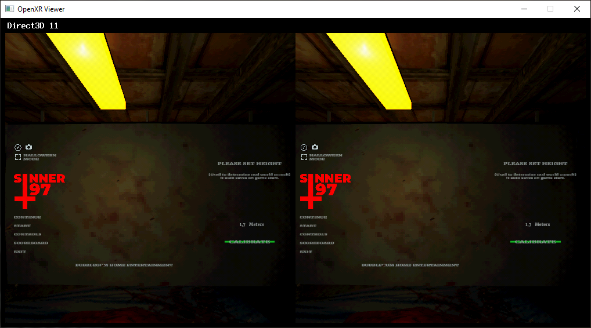

# OpenXR Simulator

**OpenXR Simulator** is a runtime implementation for the OpenXR api,  
to run OpenXR games and applications without the need for a physical VR/AR headset.

<picture>
  <source srcset="screenshots/sinner_97.png 2x" />
  
</picture>

Game in screenshot: [Sinner 97](https://store.steampowered.com/app/2004370/Sinner_97/)

## Support

| platform / graphics api -> | Direct3D 11        | OpenGL 3.0+        |
| ---                        | ---                | ---                |
| Linux (X11)                |                    | :heavy_check_mark: |
| Linux (Wayland)            |                    | :heavy_check_mark: |
| Windows (Win32)            | :heavy_check_mark: | :heavy_check_mark: |

## How to build

This project uses c_make as its build system. The following commands should get you going.  
For more details see [https://github.com/jrng/c_make](https://github.com/jrng/c_make).  
Once the runtime has been registered you can start any game that supports OpenXR.

### Linux and macOS

```shell
$ cc -o c_make c_make.c  # only needs to happen once
$ ./c_make setup build
$ ./c_make build build
# to register the runtime for the openxr loader to find (only once)
$ ./scripts/register.sh build/openxr_simulator.so
```

On macOS the runtime can be registered and will show up for games to use,  
but will not render anything on the screen.

### Windows

```shell
$ cl -Fec_make.exe c_make.c  # only needs to happen once
$ c_make setup build
$ c_make build build
# to register the runtime for the openxr loader to find (only once)
$ scripts\register.bat build\openxr_simulator.dll
```

## How to control

**W A S D** - Head movement  
**Q E** - Head movement up and down  
**Mouse click and drag** - Look around

## References

### OpenXR

- The OpenXR™ 1.1.x Specification (with all registered extensions): [https://registry.khronos.org/OpenXR/specs/1.1/html/xrspec.html](https://registry.khronos.org/OpenXR/specs/1.1/html/xrspec.html)
- OpenXR™ Loader - Design and Operation: [https://registry.khronos.org/OpenXR/specs/1.0/loader.html](https://registry.khronos.org/OpenXR/specs/1.0/loader.html)
